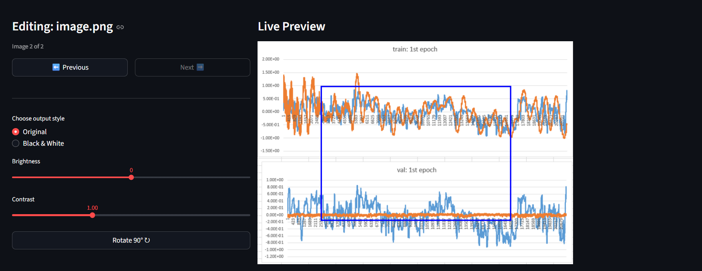
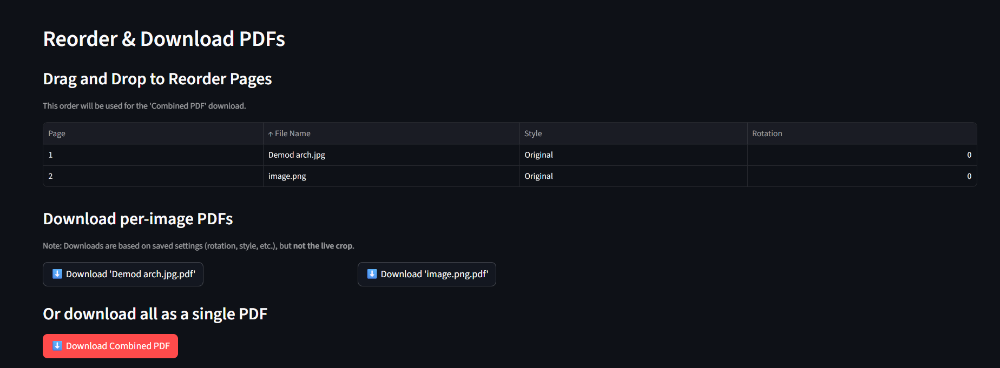

# 📄 Document Editor & PDF Converter

A simple web application built with Streamlit that allows you to upload one or more images, perform various edits, and convert them into single or combined PDF documents.

This tool is perfect for quickly scanning, cleaning, and compiling documents from your phone or computer into a professional-looking PDF.

## 📸 Screenshots

### Editing Interface
The main editor allows you to crop, rotate, and adjust the brightness, contrast, and style for each image individually.



### Reorder & Download
After editing, you can drag-and-drop your images into the correct order and download them individually or as a single combined PDF.



## ✨ Features

* **Multi-Image Upload:** Upload multiple `.jpg`, `.jpeg`, or `.png` files at once.
* **Per-Image Editing:**
    * **Interactive Cropping:** Select the exact area you want to keep.
    * **Rotation:** Rotate images in 90-degree increments.
    * **Adjustments:** Fine-tune brightness and contrast with sliders.
    * **Visual Styles:** Choose between "Original" and a high-contrast "Black & White" (scanner) effect.
* **Batch Operations:**
    * Apply the settings from one image to all other uploaded images with a single click.
* **Page Reordering:**
    * Use a drag-and-drop table to reorder the pages before final export.
* **PDF Conversion:**
    * Download each edited image as its own, separate PDF.
    * Download all images, in the order you specified, as a single combined multi-page PDF.

## 🛠️ Installation & Requirements

This project requires Python and several libraries.

1.  **Install the required libraries:**
    ```bash
    pip install streamlit opencv-python Pillow numpy streamlit-cropper pandas
    ```

2.  **File Structure:**
    Ensure your directory contains all the necessary files:
    ```
    /your-project-folder
        ├── app.py
        ├── README.md
        ├── editing.png
        └── download.png
    ```

## 🚀 How to Run

1.  Open your terminal or command prompt.
2.  Navigate to the directory containing the `app.py` file.
3.  Run the following command:

    ```bash
    streamlit run app.py
    ```

4.  The application will automatically open in your default web browser.